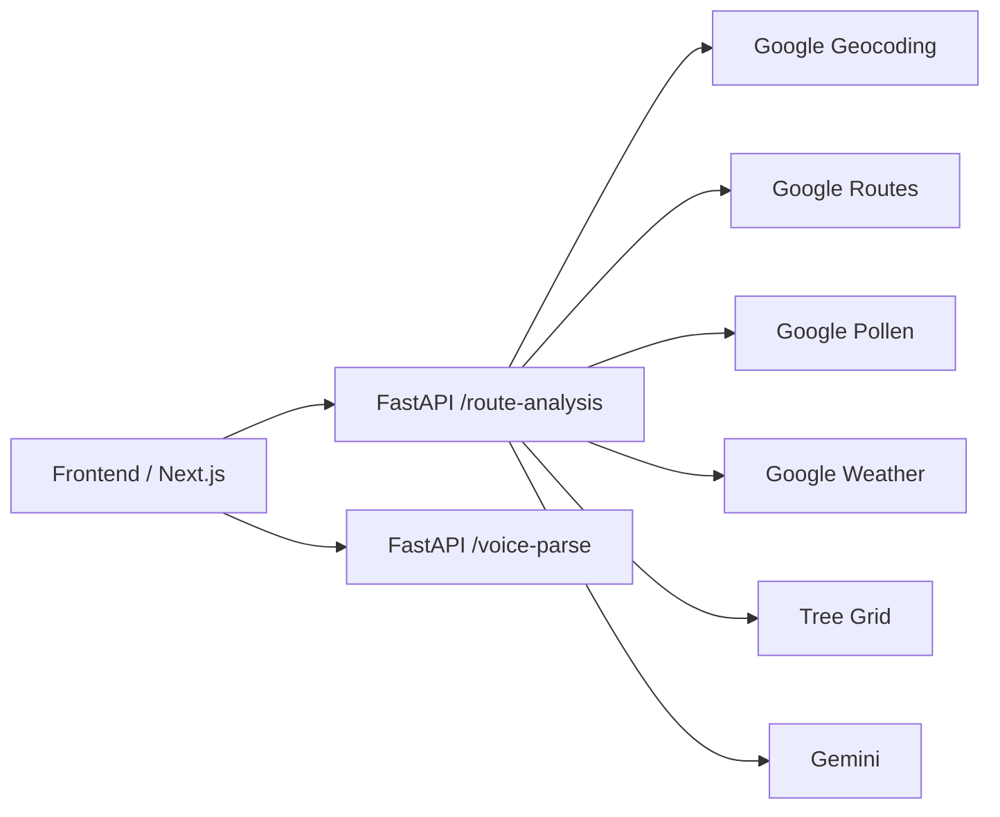

# treeroute

treeroute is a multimodal walking route planner for allergy-sensitive New Yorkers.

It ranks walking alternatives by likely pollen exposure using:

- NYC street tree census data
- live pollen conditions
- live weather and wind
- Google routing APIs
- Gemini-generated grounded explanations


## Repository Layout

The repo is now split by responsibility:

```text
frontend/   Next.js + React + TypeScript application
backend/    FastAPI + Python backend
data/       sample and generated tree-grid datasets
docs/       project docs and demo assets
```

### Frontend

```text
frontend/
  app/                   Next.js routes and layout
  features/              feature modules: landing, planner, register
  shared/                shared api client, contracts, storage, ui
  public/                frontend static assets
  tests/                 frontend/unit tests
  scripts/docs/          frontend demo capture utilities
```

### Backend

```text
backend/
  app/
    api/                 FastAPI entrypoint and route handlers
    services/            orchestration use cases
    domain/              scoring, geometry, tree-grid logic
    integrations/        Google/Gemini integrations
    schemas/             Pydantic request/response models
  tests/                 backend tests
  scripts/
    data/                data preparation scripts
    health/              backend health checks
```

### Data

```text
data/
  sample/                checked-in sample data used by the app
  generated/             generated outputs from data-prep scripts
```

The current demo grid used by the backend lives at [data/sample/tree-grid.sample.json](./data/sample/tree-grid.sample.json).
If [data/generated/tree-grid.generated.json](./data/generated/tree-grid.generated.json) exists, the backend will prefer it automatically.

## Runtime Architecture



- `frontend/` owns all browser code and UI behavior.
- `backend/` owns all backend runtime logic.
- The route score is calculated only in Python inside [backend/app/domain/scoring.py](./backend/app/domain/scoring.py).

## Local Setup

1. Create a Python virtual environment in the repo root:

```bash
python -m venv .venv
.\.venv\Scripts\python.exe -m pip install -r backend/requirements.txt
```

2. Install frontend dependencies:

```bash
cd frontend
npm install
```

3. Create `.env.local` in the repo root:

```bash
NEXT_PUBLIC_GOOGLE_MAPS_API_KEY=
NEXT_PUBLIC_FASTAPI_BASE_URL=http://localhost:8000
GOOGLE_MAPS_API_KEY=
GOOGLE_POLLEN_API_KEY=
GOOGLE_WEATHER_API_KEY=
GOOGLE_AI_API_KEY=
GEMINI_MODEL=gemini-2.5-flash
TREE_GRID_PATH=
CORS_ALLOW_ORIGINS=http://localhost:3000
```

- `TREE_GRID_PATH` is optional. Set it when you want to force a specific tree-grid file; otherwise the backend prefers `data/generated/tree-grid.generated.json` and falls back to the checked-in sample grid.

## Run The App

Backend:

```bash
cd backend
..\.venv\Scripts\python.exe -m uvicorn app.api.main:app --host 127.0.0.1 --port 8000 --env-file ..\.env.local
```

Frontend:

```bash
cd frontend
npm run dev
```

## Useful Commands

Frontend:

```bash
cd frontend
npm run dev
npm run build
npm run test
npm run check:types
npm run verify
npm run capture:readme-demo
npm run build:readme-demo-gif
```

Backend:

```bash
cd backend
..\.venv\Scripts\python.exe -m unittest discover -s tests
..\.venv\Scripts\python.exe scripts\health\check_fastapi_ready.py
..\.venv\Scripts\python.exe scripts\data\build_tree_grid.py ..\StreetTreeCensus.csv ..\data\generated\tree-grid.generated.json
```

## Key Files

| Path | Purpose |
|---|---|
| `frontend/app` | Next.js routes and layout |
| `frontend/features` | feature-oriented frontend modules |
| `frontend/shared` | shared frontend code |
| `backend/app/api/main.py` | FastAPI application entrypoint |
| `backend/app/services/route_analysis.py` | route-analysis orchestration |
| `backend/app/domain/scoring.py` | route scoring logic |
| `backend/app/domain/tree_grid.py` | tree-grid lookup layer |
| `backend/app/integrations` | Google and Gemini integrations |
| `backend/app/schemas/models.py` | backend request/response models |
| `backend/scripts/data/build_tree_grid.py` | grid generation script |
| `data/sample/tree-grid.sample.json` | checked-in sample tree grid |

## Docker

Frontend image:

```bash
docker build -f frontend/Dockerfile frontend
```

Backend image:

```bash
docker build -f backend/Dockerfile .
```
