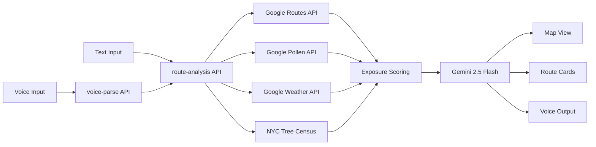

# treeroute

**treeroute** is a multimodal, AI-powered walking route planner for allergy-sensitive New Yorkers. It maps 700,000+ NYC street trees to your allergy profile, layers live pollen pressure, wind, and humidity, and ranks walking routes by expected pollen exposure — so you walk safer, not just faster.

Built for the NYC Build With AI Hackathon using Google GenAI SDK, Gemini 2.5 Flash, ADK agent architecture, and the NYC 2015 Street Tree Census.

---

## Multimodal experience

treeroute covers all three modalities:

| Modality | Implementation |
|---|---|
| **Speak** | Web Speech API mic button — say "from Washington Square to Lincoln Center" |
| **Hear** | `speechSynthesis` reads the recommended route aloud after analysis |
| **See** | Google Maps route overlay with polylines, origin/destination markers, and hotspot circles |

Voice input is parsed by Gemini via `/api/voice-parse` to extract origin and destination from natural speech. The voice button is available on both the landing page and the planner.

---

## Agent architecture (ADK pattern)

The route analysis API uses an ADK-style single-turn orchestration agent in [`lib/server/agent.ts`](lib/server/agent.ts):

1. **Tool declarations** — 4 `FunctionDeclaration` objects registered with Gemini: `fetch_walking_routes`, `fetch_pollen_data`, `fetch_weather_data`, `score_route_exposure`
2. **Parallel tool execution** — all three Google APIs (Routes, Pollen, Weather) are called concurrently via `Promise.all`
3. **Scoring** — routes are scored against the NYC Street Tree Census grid (species match, canopy density, weather boost)
4. **Gemini synthesis** — a single Gemini call receives all tool results as grounded context and returns JSON with `summary`, `civicSummary`, and `routeExplanations`
5. **`FunctionCallingConfigMode.NONE`** — prevents Gemini from re-invoking tools; ensures grounded single-turn response

The `dataSources` field in every response includes `"Gemini Agent · ADK function calling"`.

---

## Product flow

```
/ (landing)  →  /register  →  /planner
```

1. User enters start and end on the landing page (typed or by voice)
2. Route draft is saved to `localStorage`
3. User registers once with name, email, sensitivity, and tree-species triggers
4. Planner opens with the saved route prefilled — analysis runs immediately

---

## Architecture



---

## Why this fits the hackathon

| Criteria | Implementation |
|---|---|
| **Multimodal UX (40%)** | Voice in → Gemini NLP → voice out + map — all in one flow |
| **Agent Architecture (30%)** | ADK FunctionDeclaration pattern, parallel tool execution, grounded Gemini synthesis |
| **Google APIs** | Routes, Pollen, Weather, Geocoding, Maps JS, Gemini |
| **Civic data** | NYC 2015 Street Tree Census (700k+ mapped trees) |
| **Public interest** | Safer outdoor navigation for allergy-sensitive residents |

---

## Quick start

```bash
cp .env.example .env.local
# Add your API keys to .env.local
npm install
npm run dev
```

Open `http://localhost:3000` and try the demo scenario below.

---

## Environment variables

| Variable | Purpose |
|---|---|
| `NEXT_PUBLIC_GOOGLE_MAPS_API_KEY` | Maps JS + Places autocomplete (browser) |
| `GOOGLE_MAPS_API_KEY` | Routes API + Geocoding (server) |
| `GOOGLE_POLLEN_API_KEY` | Pollen signal lookup |
| `GOOGLE_WEATHER_API_KEY` | Weather signal lookup |
| `GOOGLE_AI_API_KEY` | Gemini — voice parsing + route synthesis |
| `GEMINI_MODEL` | Optional model override (default: `gemini-2.5-flash`) |

All signals have graceful fallbacks — the app works in degraded mode without some keys.

---

## Demo scenario

- **From:** Washington Square Park, New York, NY
- **To:** Lincoln Center, New York, NY
- **Triggers:** oak, birch, maple
- **Sensitivity:** medium or high

Or try saying: *"from Washington Square Park to Lincoln Center"* using the mic button.

This scenario shows a clear tradeoff between route speed and pollen exposure across Broadway, 6th Ave, and Amsterdam Ave corridors.

---

## Key files

| File | Role |
|---|---|
| [`lib/server/agent.ts`](lib/server/agent.ts) | ADK agent — tool declarations, parallel fetch, Gemini synthesis |
| [`app/api/voice-parse/route.ts`](app/api/voice-parse/route.ts) | Gemini NLP — extracts origin/destination from voice transcript |
| [`components/voice-button.tsx`](components/voice-button.tsx) | Web Speech API mic + state machine |
| [`components/pollen-safe-app.tsx`](components/pollen-safe-app.tsx) | Planner — analysis, map, route cards, speechSynthesis |
| [`lib/scoring.ts`](lib/scoring.ts) | Exposure scoring — tree census × pollen × weather × sensitivity |
| [`lib/server/google-maps.ts`](lib/server/google-maps.ts) | Routes API + geocoding + fallback route builder |

---

## Tree grid preprocessing

The repo includes a demo grid at `data/tree-grid.sample.json` (NYC sample).

To build from the full 700k-tree census CSV:

```bash
npm run build-tree-grid -- ./StreetTreeCensus.csv ./data/tree-grid.generated.json
```

---

## Commands

```bash
npm run dev        # development server
npm run build      # production build
npm run test       # run tests (vitest)
```

---

## Deployment

The app is configured for standalone Next.js output and includes a `Dockerfile` for Cloud Run:

```bash
gcloud run deploy treeroute \
  --source . \
  --region us-central1 \
  --allow-unauthenticated \
  --set-env-vars GOOGLE_AI_API_KEY=...,GOOGLE_MAPS_API_KEY=...
```

---

## Team

| Name | GitHub |
|---|---|
| Daniyar | [@daniyar-udel](https://github.com/daniyar-udel) |
| Vera Vecherskaia | [@vvchrsk](https://github.com/vvchrsk) |
| Daniel Naumov | [@dnauminator](https://github.com/dnauminator) |
| Beibarys Nyussupov | [@NBeibarys](https://github.com/NBeibarys) |
